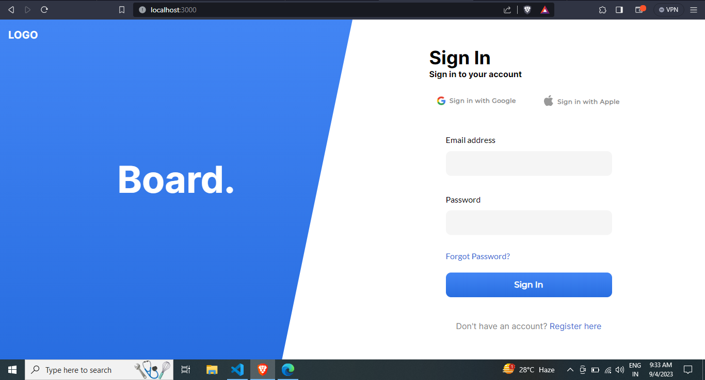
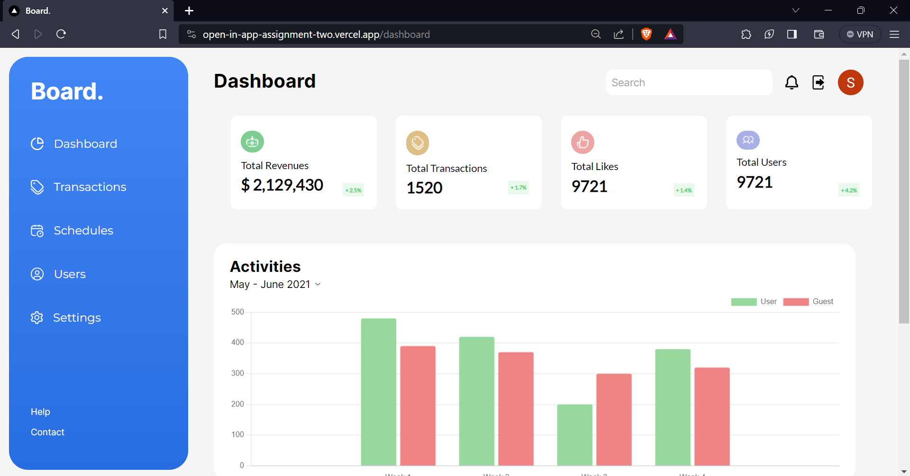
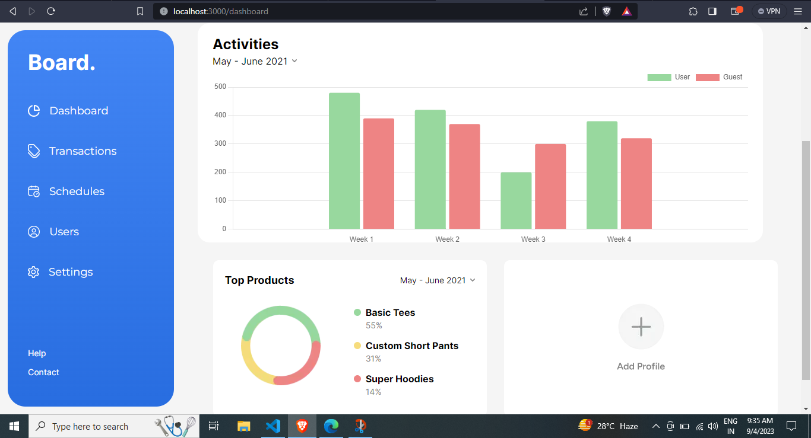
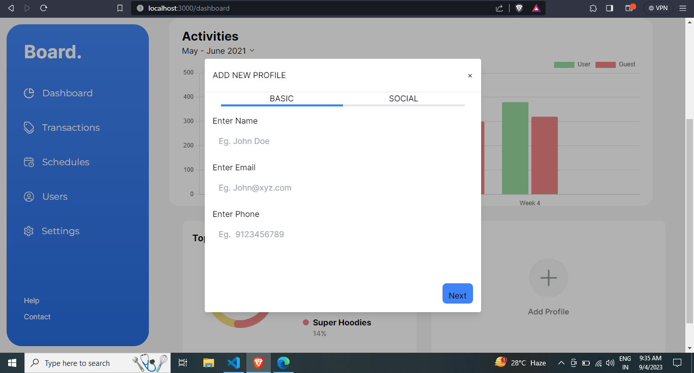
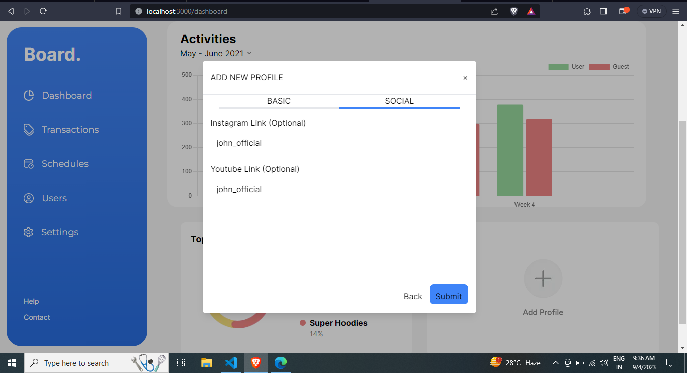
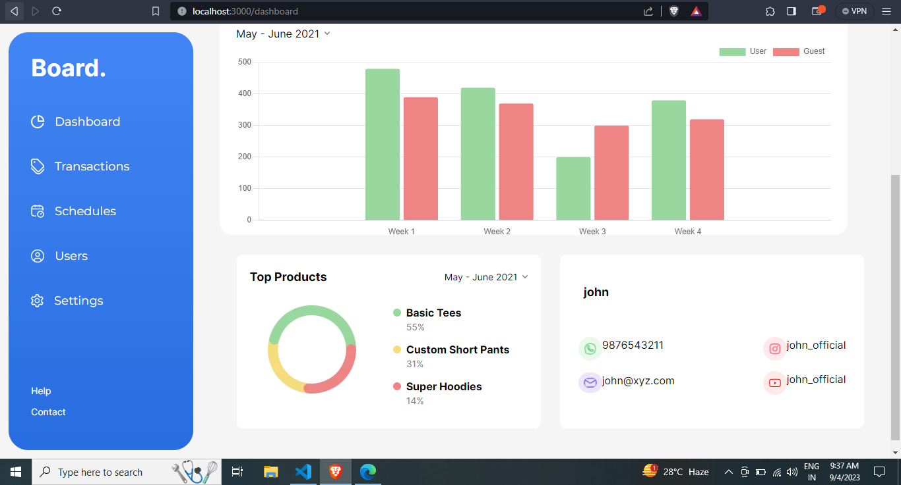

# OPEN_IN_APP

## Live Link

## Video Preview

## Images

<!-- 




 -->

<hr/>

## Getting Started

First, run the development server:

```bash
npm run dev

Open [http://localhost:3000](http://localhost:3000) with your browser to see the result.
```
